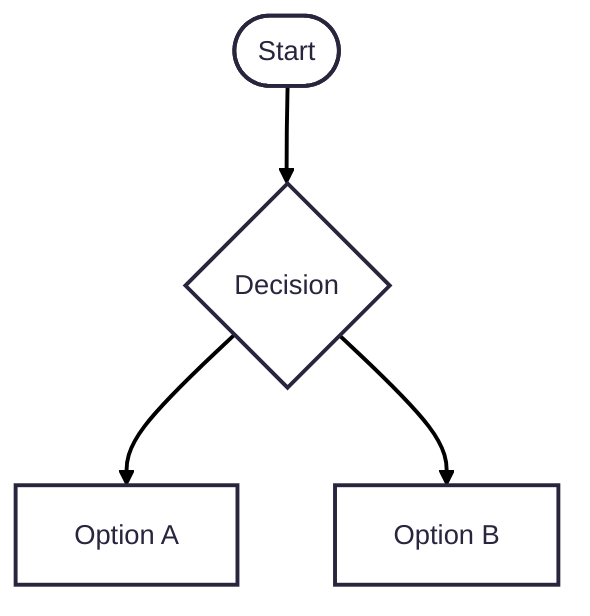

# All markdown renderables 

- [Ember](#ember)
- [Svelte](#svelte)
- [Vue](#vue)
- [Mermaid](#mermaid)
- [React](#react)

## Ember


```gjs live
import Component from '@glimmer/component';
import { tracked } from '@glimmer/tracking';
import { on } from '@ember/modifier';

export default class HelloWorld extends Component {
  @tracked count = 0;
  increment = () => this.count++;
  decrement = () => this.count--;

  <template>
    <p>Count: {{this.count}}</p>

    <button {{on "click" this.increment}}>Increment</button>
    <button {{on "click" this.decrement}}>Decrement</button>
  </template>
}
```


<details><summary>Alternate format that exists only in this REPL</summary>

```hbs ember live
<ul>
  {{#each (array
    (hash href='https://emberjs.com' text='Ember home page')
    (hash href='https://github.com/nullvoxpopuli' text='My GitHub')
    (hash href='https://twitter.com/nullvoxpopuli' text='My Twitter')
  ) as |site|}}
    <li>
      <a href={{site.href}} target="_blank">{{site.text}}</a>
    </li>
  {{/each}}
</ul>
```

</details>

## Svelte

```svelte live
<script>
	let value = $state(0);
</script>

<p>Count: {value}</p>

<button onclick={() => value += 1}>Increment</button>
<button onclick={() => value -= 1}>Decrement</button>
```

## Vue

```vue live
<script setup>
  import { ref } from 'vue'

  const count = ref(0)
</script>

<template>
  <p>Count: {{ count }}</p>

  <button @click="count++">Increment</button>
  <button @click="count--">Decrement</button>
</template>
```

## Mermaid



## React


```jsx react live
import React, { useState } from 'react';  

function Counter() {  
  const [count, setCount] = useState(0);  

  const increment = () => setCount((prevCount) => prevCount + 1);  
  const decrement = () => setCount((prevCount) => prevCount - 1);  

  return (  
    <>
      <p>Count: {count}</p>
      <button onClick={increment}>Increment</button>  
      <button onClick={decrement}>Decrement</button>  
    </>
  );
} 

export default <Counter />;  
```

